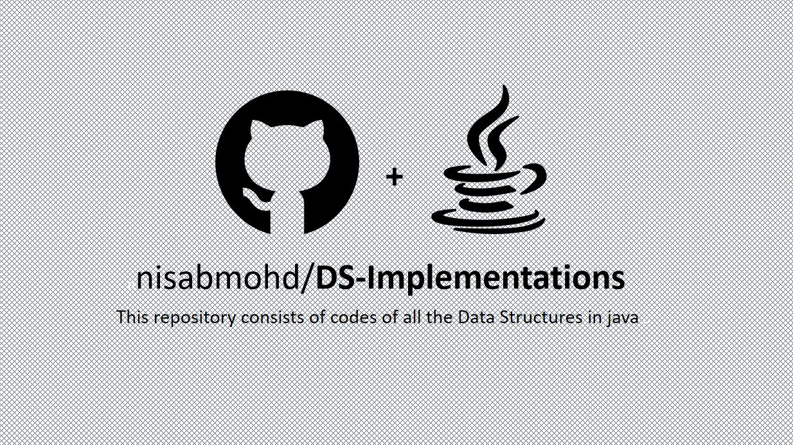

# Data Structure Implementations in Java
#### This repo contains all the Internal Java and custom data structure used for problem solving and for Interview prep.

## Table Of Contents
- <a href="https://github.com/nisabmohd/DS-Implementations/tree/master/src/Lists">List</a>
  - <a href="https://github.com/nisabmohd/DS-Implementations/blob/master/src/Lists/ArrayListCustom.java">ArrayList</a>
  - <a href="https://github.com/nisabmohd/DS-Implementations/blob/master/src/Lists/SingleLinkedList.java">SingleLinkedList</a>
  - <a href="https://github.com/nisabmohd/DS-Implementations/blob/master/src/Lists/DoubleLinkedList.java">DoubleLinkedList</a>
  - <a href="https://github.com/nisabmohd/DS-Implementations/blob/master/src/Lists/CircularLinkedLIst.java">CircularLinkedList</a>
  - <a href="https://github.com/nisabmohd/DS-Implementations/blob/master/src/Lists/StackCustom.java">Stack</a>

#
  
- <a href="https://github.com/nisabmohd/DS-Implementations/tree/master/src/Queues">Queues</a>
  - <a href="https://github.com/nisabmohd/DS-Implementations/blob/master/src/Queues/QueueCustom.java">Queue</a>
  - <a href="https://github.com/nisabmohd/DS-Implementations/blob/master/src/Queues/DequeCustom.java">Deque</a>
  - <a href="https://github.com/nisabmohd/DS-Implementations/blob/master/src/Queues/CircularQueue.java">CircularQueue</a>
#
 - <a href="https://github.com/nisabmohd/DS-Implementations/tree/master/src/Trees">Tree</a>
   - <a href="https://github.com/nisabmohd/DS-Implementations/blob/master/src/Trees/BinaryTree.java">BinaryTree</a>
   - <a href="https://github.com/nisabmohd/DS-Implementations/blob/master/src/Trees/BST.java">BinarySearchTree</a>
   - <a href="https://github.com/nisabmohd/DS-Implementations/blob/master/src/Trees/N_ary.java">N_Arry</a>
# 
- <a href="https://github.com/nisabmohd/DS-Implementations/tree/master/src/Maps">Map</a>
  - <a href="https://github.com/nisabmohd/DS-Implementations/blob/master/src/Maps/HashMapCustom.java">HashMap</a>
  - <a href="https://github.com/nisabmohd/DS-Implementations/blob/master/src/Maps/LinkedHashMapCustom.java">LinkedHashMap</a>
  - <a href="https://github.com/nisabmohd/DS-Implementations/blob/master/src/Maps/TreeMapCustom.java">TreeMap</a>
#  
- <a href="https://github.com/nisabmohd/DS-Implementations/tree/master/src/Sets">Set</a>
   - <a href="https://github.com/nisabmohd/DS-Implementations/blob/master/src/Sets/HashSetCustom.java">HashSet</a>
   - <a href="https://github.com/nisabmohd/DS-Implementations/blob/master/src/Sets/LinkedHashSetCustom.java">LinkedHashSet</a>
   - <a href="https://github.com/nisabmohd/DS-Implementations/blob/master/src/Sets/TreeSetCustom.java">TreeSet</a>
#   
- <a href="https://github.com/nisabmohd/DS-Implementations/tree/master/src/Heaps">Heap</a>
   - <a href="https://github.com/nisabmohd/DS-Implementations/blob/master/src/Heaps/MaxHeap.java">MaxHeap</a>
   - <a href="https://github.com/nisabmohd/DS-Implementations/blob/master/src/Heaps/MinHeap.java">MinHeap</a>
   - <a href="https://github.com/nisabmohd/DS-Implementations/blob/master/src/Heaps/HeapUsingHeapify.java">Heap using Heapify</a>
#
- <a href="https://github.com/nisabmohd/DS-Implementations/tree/master/src/Trie">Trie</a>
   - <a href="https://github.com/nisabmohd/DS-Implementations/blob/master/src/Trie/Trie.java">Trie</a>
#   
- <a href="https://github.com/nisabmohd/DS-Implementations/tree/master/src/Graphs">Graph</a>
   - <a href="https://github.com/nisabmohd/DS-Implementations/blob/master/src/Graphs/Graph.java">Graph</a> 
#

<h2 align="center">Connect with me : </h2>

  &ensp;
  &ensp;
  &ensp;
  

